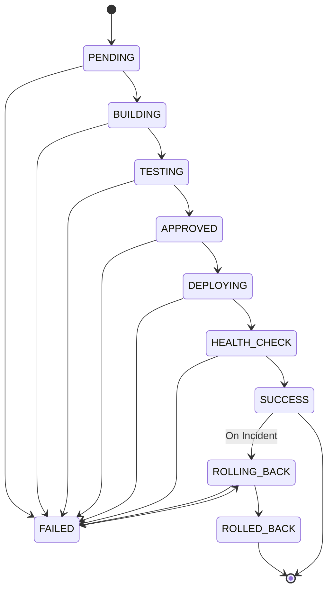

# Deployment Contract Specification

**Document Version:** 1.0.0  
**Status:** Canonical Interface Definition  
**Last Updated:** Phase 0 (Foundation)

---

## 1. Overview & Abstraction Objective

The deployment subsystem insulates the platform and the agent from cloud-specific APIs and proprietary hosting interfaces. Whether an application is deployed to **Vercel** (frontend / serverless), **Render** (containerized services / background workers), or **Nebius AI Cloud** (GPU inference services / model serving), the core platform operates against a single uniform contract: `DeploymentProvider`.

```
               +------------------------------------+
               |         Deployment Service         |
               +-----------------+------------------+
                                 |
                     DeploymentProvider (Contract)
                                 |
         +-----------------------+-----------------------+
         |                       |                       |
         v                       v                       v
+-----------------+     +-----------------+     +-----------------+
|  VercelAdapter  |     |  RenderAdapter  |     |  NebiusAdapter  |
+--------+--------+     +--------+--------+     +--------+--------+
         |                       |                       |
         v                       v                       v
    Vercel API              Render API            Nebius AI Cloud
```

---

## 2. Deployment States & State Machine

Every deployment managed by the platform transitions through a strictly ordered finite state machine.

### Canonical States:
1. `PENDING`: Deployment record created, waiting for queue worker or approvals.
2. `BUILDING`: Provider has accepted the build and is compiling assets / Docker images.
3. `TESTING`: Pre-deployment smoke tests or integration validations are executing.
4. `APPROVED`: Mandatory review, risk assessment, or human gate has passed.
5. `DEPLOYING`: Artifact is being rolled out to target runtime instances.
6. `HEALTH_CHECK`: Traffic is routed to the new version; automated probes verify liveliness.
7. `SUCCESS`: Health checks verified; deployment is active and healthy.
8. `FAILED`: Build, test, rollout, or health check failed.
9. `ROLLING_BACK`: Automated or human-initiated revert in progress.
10. `ROLLED_BACK`: Successfully reverted to previous known-good deployment.

### State Transition Rules:


---

## 3. Provider Abstraction Interface

Any concrete adapter must implement the Python conceptual protocol:

```python
class DeploymentProvider(Protocol):
    """Abstract interface defining required provider capabilities."""

    async def deploy(self, request: DeploymentRequest) -> DeploymentResponse:
        """Trigger a deployment on the target provider."""
        ...

    async def get_status(self, provider_deployment_id: str) -> DeploymentStatusResponse:
        """Fetch normalized state of the deployment from the provider."""
        ...

    async def get_logs(self, provider_deployment_id: str, tail: int = 100) -> DeploymentLogsResponse:
        """Fetch logs from the provider build or runtime stream."""
        ...

    async def rollback(self, request: RollbackRequest) -> RollbackResponse:
        """Revert the active deployment to a prior target version or trigger provider rollback."""
        ...
```

---

## 4. Request & Response Data Shapes

### 4.1 `DeploymentRequest`
```json
{
  "$schema": "https://json-schema.org/draft/2020-12/schema",
  "title": "DeploymentRequest",
  "type": "object",
  "required": [
    "deployment_id",
    "project_id",
    "environment",
    "commit_sha",
    "provider"
  ],
  "properties": {
    "deployment_id": { "type": "string", "format": "uuid" },
    "project_id": { "type": "string" },
    "environment": { "type": "string", "enum": ["staging", "production"] },
    "commit_sha": { "type": "string" },
    "branch": { "type": "string" },
    "provider": { "type": "string", "enum": ["vercel", "render", "nebius"] },
    "environment_variables": {
      "type": "object",
      "additionalProperties": { "type": "string" },
      "description": "Provider-specific non-secret configurations or variable overrides."
    },
    "metadata": { "type": "object" }
  }
}
```

### 4.2 `DeploymentResponse`
```json
{
  "$schema": "https://json-schema.org/draft/2020-12/schema",
  "title": "DeploymentResponse",
  "type": "object",
  "required": [
    "deployment_id",
    "provider_deployment_id",
    "state",
    "created_at"
  ],
  "properties": {
    "deployment_id": { "type": "string", "format": "uuid" },
    "provider_deployment_id": { "type": "string" },
    "state": {
      "type": "string",
      "enum": ["PENDING", "BUILDING", "DEPLOYING"]
    },
    "url": { "type": ["string", "null"] },
    "created_at": { "type": "string", "format": "date-time" }
  }
}
```

### 4.3 `DeploymentStatusResponse`
```json
{
  "$schema": "https://json-schema.org/draft/2020-12/schema",
  "title": "DeploymentStatusResponse",
  "type": "object",
  "required": ["deployment_id", "provider_deployment_id", "state", "updated_at"],
  "properties": {
    "deployment_id": { "type": "string", "format": "uuid" },
    "provider_deployment_id": { "type": "string" },
    "state": {
      "type": "string",
      "enum": [
        "PENDING", "BUILDING", "TESTING", "APPROVED", "DEPLOYING",
        "HEALTH_CHECK", "SUCCESS", "FAILED", "ROLLING_BACK", "ROLLED_BACK"
      ]
    },
    "url": { "type": ["string", "null"] },
    "error_summary": { "type": ["string", "null"] },
    "updated_at": { "type": "string", "format": "date-time" }
  }
}
```

### 4.4 `DeploymentLogsResponse`
```json
{
  "$schema": "https://json-schema.org/draft/2020-12/schema",
  "title": "DeploymentLogsResponse",
  "type": "object",
  "required": ["deployment_id", "lines"],
  "properties": {
    "deployment_id": { "type": "string", "format": "uuid" },
    "lines": {
      "type": "array",
      "items": {
        "type": "object",
        "required": ["timestamp", "message", "source"],
        "properties": {
          "timestamp": { "type": "string", "format": "date-time" },
          "source": { "type": "string", "enum": ["build", "stdout", "stderr", "health_check"] },
          "message": { "type": "string" }
        }
      }
    }
  }
}
```

### 4.5 `RollbackRequest`
```json
{
  "$schema": "https://json-schema.org/draft/2020-12/schema",
  "title": "RollbackRequest",
  "type": "object",
  "required": ["deployment_id", "reason"],
  "properties": {
    "deployment_id": { "type": "string", "format": "uuid" },
    "target_deployment_id": {
      "type": ["string", "null"],
      "description": "Specific healthy prior deployment to restore. If null, provider defaults to last successful."
    },
    "reason": { "type": "string" }
  }
}
```

### 4.6 `RollbackResponse`
```json
{
  "$schema": "https://json-schema.org/draft/2020-12/schema",
  "title": "RollbackResponse",
  "type": "object",
  "required": ["rollback_id", "state", "target_version"],
  "properties": {
    "rollback_id": { "type": "string", "format": "uuid" },
    "state": { "type": "string", "enum": ["ROLLING_BACK", "ROLLED_BACK", "FAILED"] },
    "target_version": { "type": "string" },
    "initiated_at": { "type": "string", "format": "date-time" }
  }
}
```

---

## 5. Planned Concrete Adapters

1. **`VercelAdapter` (Phase 8):**
   - Targets Next.js and static/SSR web frontends.
   - Wraps Vercel REST API (`/v13/deployments`).
   - Translates Vercel aliases and rollback mechanisms.

2. **`RenderAdapter` (Phase 8):**
   - Targets backend web services, worker nodes, and internal APIs.
   - Wraps Render REST API (`/v1/services/{serviceId}/deploys`).
   - Supports zero-downtime health check verification.

3. **`NebiusAdapter` (Phase 12):**
   - Targets GPU inference nodes, model endpoint deployments, and containerized AI workloads on Nebius AI Cloud.
   - Manages model endpoint warm-up, scale-to-zero, and GPU availability checks.
