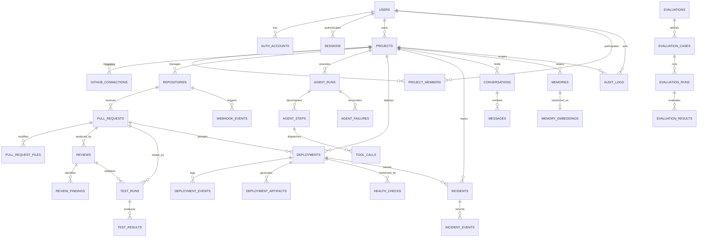

# Database Architecture Specification: AI DevOps Assistant

**Document Version:** 1.0.0  
**Status:** Canonical Database Blueprint & Phase 1 Implementation Specification  
**Engine:** PostgreSQL 16+ (with `pgvector` extension for Phase 11)  
**ORM & Migration:** SQLAlchemy 2.0 (Async + Sync) & Alembic  
**Architecture:** Modular Monolith with Isolated Repositories and Tool-Mediated Agent Access  

---

## 1. Architecture Overview & Design Principles

The **AI DevOps Assistant** requires a robust, relational data backbone supporting the end-to-end lifecycle:
```
User -> Authentication -> Projects -> GitHub Repositories -> Pull Requests 
     -> Code Analysis -> AI Review -> Testing -> Risk Assessment 
     -> Human Approval -> Deployment -> Monitoring -> Incident Detection 
     -> AI Diagnosis -> Replanning -> Rollback -> Recovery 
     -> Conversations -> Memory -> Evaluation -> Audit Log
```

### Core Tenets:
1. **Relational Integrity First:** Core domain entities and invariants are enforced directly within PostgreSQL through primary keys, foreign keys with explicit `ON DELETE` rules, unique constraints, and check constraints.
2. **Selective JSONB Policy:** JSONB is reserved strictly for heterogeneous provider metadata, tool call input/output payloads, model generation parameters, and dynamic evaluation results. Relational data is never dumped into unstructured JSON blobs.
3. **Agent Isolation Boundary:** The **Agent Core NEVER has direct database access** (no SQLAlchemy session, no raw SQL, no database credentials). The agent operates solely via the **Platform Tool Registry**, which executes domain application services that interact with database repositories.
4. **Strict Tenant & Project Isolation:** All project-scoped resources (`repositories`, `pull_requests`, `reviews`, `deployments`, `incidents`, `memories`, `conversations`) are strictly isolated by `project_id`. Access control is enforced at the domain service layer before any repository query.
5. **Phase-Gated Migrations:** While the **entire system schema is fully designed and documented here**, migrations are rolled out incrementally per development phase. Phase 1 implements only Identity, Projects, and Audit Logging foundation.

---

## 2. Complete Entity-Relationship Diagram



---

## 3. Detailed Domain Entity Schemas

### A. Identity & Authentication Domain (Phase 1)

#### `users`
Represents platform developer accounts.
- `id` (UUID, PK): Internal surrogate key (`gen_random_uuid()`).
- `email` (VARCHAR(255), UNIQUE, NOT NULL): Canonical user email.
- `display_name` (VARCHAR(120), NOT NULL): Publicly visible name.
- `avatar_url` (VARCHAR(512), NULL): Optional profile avatar link.
- `is_active` (BOOLEAN, NOT NULL, DEFAULT TRUE): Account status flag.
- `is_superuser` (BOOLEAN, NOT NULL, DEFAULT FALSE): Platform administrative privilege.
- `created_at` (TIMESTAMPTZ, NOT NULL): Record creation timestamp.
- `updated_at` (TIMESTAMPTZ, NOT NULL): Last modification timestamp.

#### `auth_accounts`
Stores authentication credentials and third-party OAuth links linked to a user.
- `id` (UUID, PK): Internal surrogate key.
- `user_id` (UUID, FK -> `users.id` ON DELETE CASCADE, NOT NULL): Owning user.
- `provider` (VARCHAR(32), NOT NULL): Auth provider (`password`, `github`, `google`).
- `provider_user_id` (VARCHAR(255), NOT NULL): Provider's external identifier or email for password accounts.
- `password_hash` (VARCHAR(255), NULL): Secure bcrypt password hash (populated ONLY when `provider = 'password'`).
- `created_at` (TIMESTAMPTZ, NOT NULL)
- `updated_at` (TIMESTAMPTZ, NOT NULL)
- **Constraints:** `UNIQUE(provider, provider_user_id)`.

#### `sessions`
Server-managed authentication sessions ensuring stateless client token validation with revocation capability.
- `id` (UUID, PK): Internal surrogate key.
- `session_token` (VARCHAR(128), UNIQUE, NOT NULL): High-entropy opaque token hash.
- `user_id` (UUID, FK -> `users.id` ON DELETE CASCADE, NOT NULL): Associated user.
- `expires_at` (TIMESTAMPTZ, NOT NULL): Hard expiration timestamp.
- `revoked_at` (TIMESTAMPTZ, NULL): Manual logout/revocation timestamp.
- `user_agent` (VARCHAR(512), NULL): Client diagnostic metadata.
- `ip_address` (VARCHAR(45), NULL): Client IP.
- `created_at` (TIMESTAMPTZ, NOT NULL)
- `updated_at` (TIMESTAMPTZ, NOT NULL)
- **Constraints:** Indexed on `(session_token)` and `(user_id, expires_at)`.

---

### B. Projects Domain (Phase 1)

#### `projects`
Organizational boundary for developer repositories, deployments, agent policies, and secrets.
- `id` (UUID, PK): Internal surrogate key.
- `name` (VARCHAR(100), NOT NULL): Project display name.
- `slug` (VARCHAR(100), UNIQUE, NOT NULL): URL-safe identifier (e.g. `ecommerce-platform`).
- `description` (TEXT, NULL): High-level project summary.
- `owner_id` (UUID, FK -> `users.id` ON DELETE RESTRICT, NOT NULL): Creator & primary admin owner.
- `is_archived` (BOOLEAN, NOT NULL, DEFAULT FALSE): Soft-archive toggle.
- `created_at` (TIMESTAMPTZ, NOT NULL)
- `updated_at` (TIMESTAMPTZ, NOT NULL)
- **Constraints:** `owner_id` RESTRICT prevents accidental orphan cascades.

#### `project_members`
Enables multi-user role-based access control (RBAC) per project.
- `id` (UUID, PK): Internal surrogate key.
- `project_id` (UUID, FK -> `projects.id` ON DELETE CASCADE, NOT NULL): Scoped project.
- `user_id` (UUID, FK -> `users.id` ON DELETE CASCADE, NOT NULL): Member user.
- `role` (VARCHAR(32), NOT NULL): RBAC role (`OWNER`, `MAINTAINER`, `DEVELOPER`, `VIEWER`).
- `created_at` (TIMESTAMPTZ, NOT NULL)
- `updated_at` (TIMESTAMPTZ, NOT NULL)
- **Constraints:** `UNIQUE(project_id, user_id)`.

---

### C. GitHub Domain (Phase 2 - Designed)

#### `github_connections`
Stores project-level GitHub App installation parameters and access tokens.
- `id` (UUID, PK): Internal key.
- `project_id` (UUID, FK -> `projects.id` ON DELETE CASCADE, NOT NULL, UNIQUE): 1:1 with project.
- `installation_id` (BIGINT, NOT NULL): GitHub App Installation ID.
- `account_login` (VARCHAR(255), NOT NULL): GitHub org or personal account name.
- `account_type` (VARCHAR(32), NOT NULL): `Organization` or `User`.
- `permissions_granted` (JSONB, NOT NULL): Scopes allowed by repo admin.
- `created_at` (TIMESTAMPTZ, NOT NULL)
- `updated_at` (TIMESTAMPTZ, NOT NULL)

#### `repositories`
Tracked Git repositories under a project.
- `id` (UUID, PK): Internal key.
- `project_id` (UUID, FK -> `projects.id` ON DELETE CASCADE, NOT NULL): Owning project.
- `github_repo_id` (BIGINT, NOT NULL): GitHub repository numeric ID.
- `owner` (VARCHAR(100), NOT NULL): Repo namespace (e.g. `facebook`).
- `name` (VARCHAR(100), NOT NULL): Repo name (e.g. `react`).
- `full_name` (VARCHAR(200), NOT NULL): `owner/name`.
- `default_branch` (VARCHAR(100), NOT NULL, DEFAULT 'main'): Base branch.
- `is_private` (BOOLEAN, NOT NULL, DEFAULT TRUE): Visibility.
- `created_at` (TIMESTAMPTZ, NOT NULL)
- `updated_at` (TIMESTAMPTZ, NOT NULL)
- **Constraints:** `UNIQUE(project_id, full_name)`.

#### `pull_requests`
Pull requests under automated review or deployment pipelines.
- `id` (UUID, PK): Internal key.
- `repository_id` (UUID, FK -> `repositories.id` ON DELETE CASCADE, NOT NULL): Parent repo.
- `github_pr_id` (BIGINT, NOT NULL): GitHub external entity ID.
- `number` (INTEGER, NOT NULL): PR number (#42).
- `title` (VARCHAR(255), NOT NULL): PR title.
- `state` (VARCHAR(32), NOT NULL): `open`, `closed`, `merged`.
- `base_sha` (VARCHAR(40), NOT NULL): Base Git commit SHA.
- `head_sha` (VARCHAR(40), NOT NULL): Head Git commit SHA.
- `author_login` (VARCHAR(100), NOT NULL): Author GitHub username.
- `created_at` (TIMESTAMPTZ, NOT NULL)
- `updated_at` (TIMESTAMPTZ, NOT NULL)
- **Constraints:** `UNIQUE(repository_id, number)`.

#### `pull_request_files`
Modified files associated with a specific PR head commit.
- `id` (UUID, PK): Internal key.
- `pull_request_id` (UUID, FK -> `pull_requests.id` ON DELETE CASCADE, NOT NULL)
- `filename` (VARCHAR(512), NOT NULL): Relative path in repository.
- `status` (VARCHAR(32), NOT NULL): `added`, `modified`, `deleted`, `renamed`.
- `additions` (INTEGER, NOT NULL, DEFAULT 0)
- `deletions` (INTEGER, NOT NULL, DEFAULT 0)
- `patch` (TEXT, NULL): Unified diff patch chunk.
- `created_at` (TIMESTAMPTZ, NOT NULL)

#### `webhook_events`
Immutable record of ingested webhooks ensuring idempotency and replayability.
- `id` (UUID, PK): Internal key.
- `external_delivery_id` (VARCHAR(100), UNIQUE, NOT NULL): GitHub `X-GitHub-Delivery` UUID.
- `event_type` (VARCHAR(64), NOT NULL): `pull_request`, `push`, `check_run`.
- `payload` (JSONB, NOT NULL): Raw event payload.
- `processed_at` (TIMESTAMPTZ, NULL): Timestamp when handled by platform.
- `status` (VARCHAR(32), NOT NULL, DEFAULT 'RECEIVED'): `RECEIVED`, `PROCESSED`, `FAILED`, `IGNORED`.
- `error_message` (TEXT, NULL): Processing exception details.
- `created_at` (TIMESTAMPTZ, NOT NULL)

---

### D. AI Code Review Domain (Phase 6/7 - Designed)

#### `reviews`
Synthesized AI code reviews produced during pull request evaluation.
- `id` (UUID, PK): Internal key.
- `pull_request_id` (UUID, FK -> `pull_requests.id` ON DELETE CASCADE, NOT NULL)
- `agent_run_id` (UUID, NULL): Optional link to `agent_runs.id`.
- `head_sha` (VARCHAR(40), NOT NULL): Commit analyzed.
- `status` (VARCHAR(32), NOT NULL): `PENDING`, `IN_PROGRESS`, `COMPLETED`, `FAILED`.
- `summary` (TEXT, NULL): Executive markdown summary of code changes.
- `overall_risk` (VARCHAR(32), NOT NULL): `LOW`, `MEDIUM`, `HIGH`, `CRITICAL`.
- `risk_rationale` (TEXT, NULL): Reason for assigned risk level.
- `verdict` (VARCHAR(32), NOT NULL): `APPROVE`, `REQUEST_CHANGES`, `COMMENT`.
- `confidence` (FLOAT, NOT NULL): Range 0.0 to 1.0.
- `model_name` (VARCHAR(100), NOT NULL): Model used (e.g. `deepseek-coder`, `nemotron-70b`).
- `token_usage` (JSONB, NOT NULL, DEFAULT '{}'): Prompt and completion token counts.
- `started_at` (TIMESTAMPTZ, NOT NULL)
- `completed_at` (TIMESTAMPTZ, NULL)
- `created_at` (TIMESTAMPTZ, NOT NULL)
- `updated_at` (TIMESTAMPTZ, NOT NULL)

#### `review_findings`
Discrete findings, suggestions, and security notices identified in a review.
- `id` (UUID, PK): Internal key.
- `review_id` (UUID, FK -> `reviews.id` ON DELETE CASCADE, NOT NULL)
- `file` (VARCHAR(512), NOT NULL): Target file path.
- `line` (INTEGER, NOT NULL): Line number.
- `end_line` (INTEGER, NULL): Ending line number for multi-line findings.
- `category` (VARCHAR(64), NOT NULL): `SECURITY`, `PERFORMANCE`, `CORRECTNESS`, `STYLE`, `BREAKING_CHANGE`.
- `severity` (VARCHAR(32), NOT NULL): `INFO`, `WARNING`, `ERROR`, `BLOCKER`.
- `description` (TEXT, NOT NULL): Detailed problem explanation.
- `recommendation` (TEXT, NOT NULL): Recommended remediation.
- `suggested_diff` (TEXT, NULL): Unified diff patch for direct auto-fix.
- `confidence` (FLOAT, NOT NULL): Range 0.0 to 1.0.
- `created_at` (TIMESTAMPTZ, NOT NULL)

---

### E. Testing Domain (Phase 6/7 - Designed)

#### `tests`
Registered deterministic tests and security check definitions.
- `id` (UUID, PK): Internal key.
- `repository_id` (UUID, FK -> `repositories.id` ON DELETE CASCADE, NOT NULL)
- `name` (VARCHAR(255), NOT NULL): Test identifier or suite name.
- `command` (VARCHAR(512), NOT NULL): Execution command (e.g. `pytest backend/tests`).
- `test_type` (VARCHAR(32), NOT NULL): `UNIT`, `INTEGRATION`, `E2E`, `STATIC_ANALYSIS`, `SECURITY_SCAN`.
- `timeout_seconds` (INTEGER, NOT NULL, DEFAULT 300)
- `created_at` (TIMESTAMPTZ, NOT NULL)
- `updated_at` (TIMESTAMPTZ, NOT NULL)

#### `test_runs`
Execution instances of tests against a specific commit or PR.
- `id` (UUID, PK): Internal key.
- `pull_request_id` (UUID, FK -> `pull_requests.id` ON DELETE SET NULL, NULL)
- `agent_run_id` (UUID, NULL): Triggering agent run.
- `commit_sha` (VARCHAR(40), NOT NULL): Git SHA under test.
- `status` (VARCHAR(32), NOT NULL): `PENDING`, `RUNNING`, `PASSED`, `FAILED`, `TIMED_OUT`.
- `duration_ms` (INTEGER, NULL): Execution duration.
- `started_at` (TIMESTAMPTZ, NOT NULL)
- `completed_at` (TIMESTAMPTZ, NULL)
- `created_at` (TIMESTAMPTZ, NOT NULL)

#### `test_results`
Individual test case outcomes within a test run.
- `id` (UUID, PK): Internal key.
- `test_run_id` (UUID, FK -> `test_runs.id` ON DELETE CASCADE, NOT NULL)
- `test_case_name` (VARCHAR(255), NOT NULL): Specific test name.
- `status` (VARCHAR(32), NOT NULL): `PASSED`, `FAILED`, `SKIPPED`, `ERROR`.
- `duration_ms` (INTEGER, NULL)
- `error_message` (TEXT, NULL): Assertion failure or stack trace.
- `created_at` (TIMESTAMPTZ, NOT NULL)

---

### F. Agent System Domain (Phase 4/5 - Designed)

#### `agent_runs`
Root execution record for an agent task invocation.
- `id` (UUID, PK): Canonical `run_id`.
- `trace_id` (UUID, NOT NULL): Distributed trace identifier.
- `project_id` (UUID, FK -> `projects.id` ON DELETE CASCADE, NOT NULL)
- `goal` (TEXT, NOT NULL): Natural language goal or user instruction.
- `status` (VARCHAR(32), NOT NULL): `PENDING`, `RUNNING`, `WAITING_FOR_APPROVAL`, `COMPLETED`, `FAILED`, `TIMED_OUT`.
- `model` (VARCHAR(100), NOT NULL): Routed LLM model.
- `model_routing_reason` (TEXT, NULL): Reason for choosing DeepSeek vs Nemotron.
- `iteration_count` (INTEGER, NOT NULL, DEFAULT 0)
- `confidence` (FLOAT, NULL): Final agent confidence.
- `total_tokens` (INTEGER, NOT NULL, DEFAULT 0)
- `total_cost_usd` (NUMERIC(8, 6), NOT NULL, DEFAULT 0.0)
- `error_message` (TEXT, NULL): Fatal error summary if failed.
- `result_summary` (TEXT, NULL): Final outcome summary.
- `started_at` (TIMESTAMPTZ, NOT NULL)
- `completed_at` (TIMESTAMPTZ, NULL)
- `created_at` (TIMESTAMPTZ, NOT NULL)
- `updated_at` (TIMESTAMPTZ, NOT NULL)
- **Constraints:** Indexed on `(project_id, status, created_at)`.

#### `agent_steps`
Discrete cognitive reasoning steps within a run (`PLAN`, `EXECUTE`, `OBSERVE`, `VERIFY`, `REFLECT`, `REPLAN`).
- `id` (UUID, PK): Internal key.
- `agent_run_id` (UUID, FK -> `agent_runs.id` ON DELETE CASCADE, NOT NULL)
- `step_number` (INTEGER, NOT NULL): Monotonically increasing sequence (1, 2, ...).
- `step_type` (VARCHAR(32), NOT NULL): `PLAN`, `EXECUTE`, `OBSERVE`, `VERIFY`, `REFLECT`, `REPLAN`.
- `thought` (TEXT, NULL): Model chain-of-thought rationale.
- `created_at` (TIMESTAMPTZ, NOT NULL)
- **Constraints:** `UNIQUE(agent_run_id, step_number)`.

#### `tool_calls`
Permanent audit trail of every tool execution requested by an agent.
- `id` (UUID, PK): Tool call identifier.
- `agent_step_id` (UUID, FK -> `agent_steps.id` ON DELETE CASCADE, NOT NULL)
- `tool_name` (VARCHAR(100), NOT NULL): Namespaced tool (e.g. `deployment.deploy`).
- `parameters` (JSONB, NOT NULL): Input parameters (sanitized; strictly zero secrets).
- `result_data` (JSONB, NULL): Output payload returned from platform tool.
- `status` (VARCHAR(32), NOT NULL): `SUCCESS`, `VALIDATION_ERROR`, `PERMISSION_DENIED`, `EXECUTION_FAILED`, `TIMEOUT`.
- `duration_ms` (INTEGER, NOT NULL)
- `retry_count` (INTEGER, NOT NULL, DEFAULT 0)
- `error_code` (VARCHAR(64), NULL)
- `error_message` (TEXT, NULL)
- `created_at` (TIMESTAMPTZ, NOT NULL)

#### `agent_failures`
Structured failure analysis when an agent run aborts or requires recovery.
- `id` (UUID, PK): Internal key.
- `agent_run_id` (UUID, FK -> `agent_runs.id` ON DELETE CASCADE, NOT NULL)
- `failure_type` (VARCHAR(64), NOT NULL): `TOOL_EXECUTION_FAILURE`, `PERMISSION_DENIED`, `MODEL_TIMEOUT`, `REASONING_LOOP`, `VALIDATION_ERROR`.
- `details` (JSONB, NOT NULL): Contextual diagnostic metadata.
- `recovery_attempted` (BOOLEAN, NOT NULL, DEFAULT FALSE)
- `created_at` (TIMESTAMPTZ, NOT NULL)

---

### G. Deployment Domain (Phase 8 - Designed)

#### `deployments`
Deployment records across abstract hosting providers (`vercel`, `render`, `nebius`).
- `id` (UUID, PK): Internal deployment surrogate key.
- `project_id` (UUID, FK -> `projects.id` ON DELETE CASCADE, NOT NULL)
- `pull_request_id` (UUID, FK -> `pull_requests.id` ON DELETE SET NULL, NULL)
- `provider` (VARCHAR(32), NOT NULL): `vercel`, `render`, `nebius`.
- `external_deployment_id` (VARCHAR(255), NULL): ID returned by cloud hosting provider.
- `environment` (VARCHAR(32), NOT NULL): `preview`, `staging`, `production`.
- `commit_sha` (VARCHAR(40), NOT NULL): Deployed Git commit SHA.
- `status` (VARCHAR(32), NOT NULL): 10 canonical states:
  `PENDING`, `BUILDING`, `TESTING`, `APPROVED`, `DEPLOYING`, `HEALTH_CHECK`, `SUCCESS`, `FAILED`, `ROLLING_BACK`, `ROLLED_BACK`.
- `url` (VARCHAR(512), NULL): Live URL or preview endpoint.
- `is_current_production` (BOOLEAN, NOT NULL, DEFAULT FALSE): Active traffic flag.
- `previous_deployment_id` (UUID, FK -> `deployments.id` ON DELETE SET NULL, NULL): For 1-click rollback reference.
- `started_at` (TIMESTAMPTZ, NOT NULL)
- `completed_at` (TIMESTAMPTZ, NULL)
- `created_at` (TIMESTAMPTZ, NOT NULL)
- `updated_at` (TIMESTAMPTZ, NOT NULL)

#### `deployment_events`
Chronological state transition events emitted during a deployment.
- `id` (UUID, PK): Internal key.
- `deployment_id` (UUID, FK -> `deployments.id` ON DELETE CASCADE, NOT NULL)
- `from_state` (VARCHAR(32), NOT NULL)
- `to_state` (VARCHAR(32), NOT NULL)
- `message` (TEXT, NOT NULL): State transition commentary.
- `metadata` (JSONB, NOT NULL, DEFAULT '{}')
- `created_at` (TIMESTAMPTZ, NOT NULL)

#### `deployment_artifacts`
Output artifacts produced during build or model serving preparation.
- `id` (UUID, PK): Internal key.
- `deployment_id` (UUID, FK -> `deployments.id` ON DELETE CASCADE, NOT NULL)
- `artifact_type` (VARCHAR(64), NOT NULL): `CONTAINER_IMAGE`, `BUILD_OUTPUT`, `CONFIG_BUNDLE`.
- `artifact_uri` (VARCHAR(512), NOT NULL): Registry URI or storage path.
- `checksum_sha256` (VARCHAR(64), NOT NULL)
- `size_bytes` (BIGINT, NOT NULL)
- `created_at` (TIMESTAMPTZ, NOT NULL)

---

### H. Observability Domain (Phase 9 - Designed)

#### `health_checks`
Post-deployment health probe checks and synthetic transactions.
- `id` (UUID, PK): Internal key.
- `deployment_id` (UUID, FK -> `deployments.id` ON DELETE CASCADE, NOT NULL)
- `probe_name` (VARCHAR(100), NOT NULL): e.g. `http_status_probe`, `ssl_check`, `p99_latency_probe`.
- `endpoint_url` (VARCHAR(512), NOT NULL)
- `status` (VARCHAR(32), NOT NULL): `HEALTHY`, `DEGRADED`, `UNHEALTHY`.
- `http_status_code` (INTEGER, NULL)
- `latency_ms` (INTEGER, NULL)
- `response_snippet` (TEXT, NULL)
- `checked_at` (TIMESTAMPTZ, NOT NULL)

---

### I. Incident & Recovery Domain (Phase 10 - Designed)

#### `incidents`
Production incidents detected through failed health checks or runtime errors.
- `id` (UUID, PK): Internal incident key.
- `project_id` (UUID, FK -> `projects.id` ON DELETE CASCADE, NOT NULL)
- `deployment_id` (UUID, FK -> `deployments.id` ON DELETE RESTRICT, NOT NULL): Affected release.
- `severity` (VARCHAR(32), NOT NULL): `SEV1_CRITICAL`, `SEV2_HIGH`, `SEV3_MEDIUM`, `SEV4_LOW`.
- `status` (VARCHAR(32), NOT NULL): `DETECTED`, `INVESTIGATING`, `DIAGNOSING`, `AWAITING_APPROVAL`, `ROLLING_BACK`, `RECOVERING`, `RESOLVED`, `FAILED`.
- `detection_source` (VARCHAR(64), NOT NULL): `HEALTH_PROBE`, `METRIC_THRESHOLD`, `USER_REPORT`.
- `title` (VARCHAR(255), NOT NULL)
- `description` (TEXT, NOT NULL)
- `diagnosis` (TEXT, NULL): Nemotron AI root cause analysis.
- `recommended_action` (TEXT, NULL): Automated remediation proposal (e.g. rollback to `deployment_id`).
- `resolved_at` (TIMESTAMPTZ, NULL)
- `created_at` (TIMESTAMPTZ, NOT NULL)
- `updated_at` (TIMESTAMPTZ, NOT NULL)

#### `incident_events`
Audit trail of actions taken during incident response.
- `id` (UUID, PK): Internal key.
- `incident_id` (UUID, FK -> `incidents.id` ON DELETE CASCADE, NOT NULL)
- `event_type` (VARCHAR(64), NOT NULL): `DIAGNOSIS_STARTED`, `ROLLBACK_TRIGGERED`, `STATUS_CHANGED`.
- `actor_type` (VARCHAR(32), NOT NULL): `SYSTEM`, `AGENT`, `USER`.
- `actor_id` (VARCHAR(100), NOT NULL)
- `notes` (TEXT, NOT NULL)
- `created_at` (TIMESTAMPTZ, NOT NULL)

---

### J. Memory & Conversations Domain (Phase 11 - Designed)

#### `conversations`
Interactive dialogue threads between developers and the DevOps assistant.
- `id` (UUID, PK): Internal conversation key.
- `project_id` (UUID, FK -> `projects.id` ON DELETE CASCADE, NOT NULL)
- `user_id` (UUID, FK -> `users.id` ON DELETE CASCADE, NOT NULL)
- `title` (VARCHAR(255), NOT NULL, DEFAULT 'New Conversation')
- `created_at` (TIMESTAMPTZ, NOT NULL)
- `updated_at` (TIMESTAMPTZ, NOT NULL)

#### `messages`
Individual user or assistant turns within a conversation.
- `id` (UUID, PK): Internal message key.
- `conversation_id` (UUID, FK -> `conversations.id` ON DELETE CASCADE, NOT NULL)
- `sender_type` (VARCHAR(32), NOT NULL): `USER`, `ASSISTANT`, `SYSTEM`.
- `content` (TEXT, NOT NULL): Markdown message content.
- `tokens` (INTEGER, NULL)
- `created_at` (TIMESTAMPTZ, NOT NULL)

#### `memories`
Long-term semantic knowledge retained across developer sessions and deployments.
- `id` (UUID, PK): Internal key.
- `project_id` (UUID, FK -> `projects.id` ON DELETE CASCADE, NOT NULL)
- `scope` (VARCHAR(32), NOT NULL): `GLOBAL`, `PROJECT`, `CONVERSATION`.
- `key` (VARCHAR(255), NOT NULL): Canonical topic or entity key.
- `content` (TEXT, NOT NULL): Distilled knowledge, incident post-mortem snippet, or convention.
- `confidence` (FLOAT, NOT NULL, DEFAULT 1.0)
- `created_at` (TIMESTAMPTZ, NOT NULL)
- `updated_at` (TIMESTAMPTZ, NOT NULL)

#### `memory_embeddings` (Phase 11 with `pgvector`)
High-dimensional semantic vector representations for similarity search.
- `memory_id` (UUID, PK, FK -> `memories.id` ON DELETE CASCADE): 1:1 with memory.
- `embedding_model` (VARCHAR(64), NOT NULL): e.g. `text-embedding-3-small`.
- `vector_dim` (INTEGER, NOT NULL): Dimensionality (e.g. 1536).
- `embedding` (VECTOR(1536), NOT NULL): pgvector column.
- `created_at` (TIMESTAMPTZ, NOT NULL)

---

### K. Evaluation System Domain (Phase 11 - Designed)

#### `evaluations`
Defines test suites for assessing agent performance, accuracy, and latency.
- `id` (UUID, PK): Internal key.
- `name` (VARCHAR(120), NOT NULL)
- `description` (TEXT, NULL)
- `target_domain` (VARCHAR(64), NOT NULL): `REVIEW_QUALITY`, `DIAGNOSIS_ACCURACY`, `TOOL_CORRECTNESS`.
- `created_at` (TIMESTAMPTZ, NOT NULL)

#### `evaluation_cases`
Specific evaluation test cases with golden ground truth.
- `id` (UUID, PK): Internal key.
- `evaluation_id` (UUID, FK -> `evaluations.id` ON DELETE CASCADE, NOT NULL)
- `name` (VARCHAR(120), NOT NULL)
- `prompt_input` (TEXT, NOT NULL)
- `expected_tools` (JSONB, NOT NULL, DEFAULT '[]')
- `expected_verdict` (VARCHAR(32), NULL)
- `created_at` (TIMESTAMPTZ, NOT NULL)

#### `evaluation_runs`
Execution batches comparing models or prompts over test cases.
- `id` (UUID, PK): Internal key.
- `evaluation_id` (UUID, FK -> `evaluations.id` ON DELETE CASCADE, NOT NULL)
- `model_evaluated` (VARCHAR(100), NOT NULL)
- `passed_cases` (INTEGER, NOT NULL, DEFAULT 0)
- `total_cases` (INTEGER, NOT NULL, DEFAULT 0)
- `avg_latency_ms` (FLOAT, NOT NULL, DEFAULT 0.0)
- `total_cost_usd` (NUMERIC(8, 6), NOT NULL, DEFAULT 0.0)
- `started_at` (TIMESTAMPTZ, NOT NULL)
- `completed_at` (TIMESTAMPTZ, NULL)
- `created_at` (TIMESTAMPTZ, NOT NULL)

#### `evaluation_results`
Individual test case execution output and scoring.
- `id` (UUID, PK): Internal key.
- `evaluation_run_id` (UUID, FK -> `evaluation_runs.id` ON DELETE CASCADE, NOT NULL)
- `evaluation_case_id` (UUID, FK -> `evaluation_cases.id` ON DELETE CASCADE, NOT NULL)
- `score` (FLOAT, NOT NULL): 0.0 to 1.0.
- `passed` (BOOLEAN, NOT NULL)
- `agent_output` (TEXT, NULL)
- `discrepancies` (TEXT, NULL)
- `duration_ms` (INTEGER, NOT NULL)
- `created_at` (TIMESTAMPTZ, NOT NULL)

---

### L. Audit & Security Domain (Phase 1 - Implemented)

#### `audit_logs`
Immutable compliance and security ledger. **No rows are ever deleted or updated.**
- `id` (UUID, PK): Surrogate audit key.
- `actor_id` (UUID, NULL): User ID who initiated the action, or NULL if system/webhook.
- `actor_type` (VARCHAR(32), NOT NULL): `USER`, `AGENT`, `SYSTEM`, `WEBHOOK`.
- `project_id` (UUID, FK -> `projects.id` ON DELETE SET NULL, NULL): Scoped project.
- `action` (VARCHAR(64), NOT NULL): e.g. `USER_LOGIN`, `PROJECT_CREATED`, `DEPLOYMENT_APPROVED`, `ROLLBACK_TRIGGERED`.
- `resource_type` (VARCHAR(64), NOT NULL): e.g. `project`, `deployment`, `incident`.
- `resource_id` (VARCHAR(255), NOT NULL): Target entity identifier.
- `result` (VARCHAR(32), NOT NULL): `SUCCESS`, `DENIED`, `ERROR`.
- `ip_address` (VARCHAR(45), NULL)
- `trace_id` (UUID, NULL): Distributed trace link.
- `metadata` (JSONB, NOT NULL, DEFAULT '{}'): Safe metadata (strictly NO secrets).
- `created_at` (TIMESTAMPTZ, NOT NULL)
- **Constraints:** Indexed on `(project_id, created_at)`, `(actor_id, created_at)`, and `(action)`.

---

## 4. Cross-Cutting Database Policies

### 4.1. Identifier Strategy
- **Internal IDs:** All relational tables use RFC 4122 **UUIDv4** as primary keys (`id UUID DEFAULT gen_random_uuid() PRIMARY KEY`). This prevents integer enumeration attacks and facilitates client-generated trace correlation.
- **External IDs:** Provider-specific identifiers (`github_repo_id`, `pull_request_number`, `external_deployment_id`, `external_delivery_id`) are stored as separate attributes with unique composite indexes, never as primary keys.

### 4.2. Timestamp Strategy
- All timestamps use `TIMESTAMPTZ` (`DateTime(timezone=True)` in SQLAlchemy) stored in canonical **UTC**.
- Every mutable table includes `created_at` and `updated_at` via the `TimestampMixin`.
- Specific lifecycle timestamps (`started_at`, `completed_at`, `expires_at`, `revoked_at`, `resolved_at`) are explicitly typed as nullable `TIMESTAMPTZ`.

### 4.3. Foreign Key & Deletion Behavior
- **Cascade Deletes (`ON DELETE CASCADE`):** Safe for tightly coupled children (e.g. `pull_requests` -> `pull_request_files`, `reviews` -> `review_findings`, `agent_runs` -> `agent_steps` -> `tool_calls`, `users` -> `sessions`, `users` -> `auth_accounts`).
- **Restrict Deletes (`ON DELETE RESTRICT`):** Applied where deleting a parent would violate business invariants (e.g. `users` as `projects.owner_id`, `deployments` with active `incidents`).
- **Set Null Deletes (`ON DELETE SET NULL`):** Applied to preserve historical auditability (e.g. `audit_logs.project_id`, `test_runs.pull_request_id`).
- **Immutable Tables:** `audit_logs`, `webhook_events`, and `tool_calls` have no application update/delete routes.

### 4.4. Soft Deletion Policy
- Soft delete (`is_archived = TRUE`) is explicitly implemented **only** for `projects`.
- Deleting an active project sets `is_archived = TRUE`, preserving operational history, deployments, and audit logs.
- Audit logs, agent runs, and incidents are **never deleted**.

### 4.5. JSONB Usage Policy
- **Permitted:** Heterogeneous model parameters, tool call arguments/returns, webhook payloads, token usage summaries.
- **Prohibited:** Entity relationships, status enumerations, search-critical timestamps, and authorization roles.

### 4.6. Transaction Boundaries
- Database transactions (`BEGIN` ... `COMMIT`) must be short-lived.
- **NEVER hold a database transaction open** while waiting on:
  - External LLM inference (DeepSeek or Nemotron).
  - GitHub REST or GraphQL API calls.
  - Deployment provider operations (Vercel, Render, Nebius).
  - Long-running automated test runners.
- Use the **Transactional Outbox / State Update Pattern**: write initial state (`PENDING`), commit transaction, execute external call, open a new transaction to record result (`SUCCESS` or `FAILED`).

---

## 5. Phase-to-Table Implementation Mapping

| Phase | Phase Name | Database Tables | Status |
| :--- | :--- | :--- | :--- |
| **Phase 0** | Foundation & Architecture Setup | *(Contract definitions & minimal placeholders)* | **Complete** |
| **Phase 1** | Authentication & Projects | `users`, `auth_accounts`, `sessions`, `projects`, `project_members`, `audit_logs` | **IMPLEMENTED** |
| **Phase 2** | GitHub Integration | `github_connections`, `repositories`, `pull_requests`, `pull_request_files`, `webhook_events` | *Designed (Future)* |
| **Phase 3** | Context Engine | Context aggregation schemas & file metadata cache | *Designed (Future)* |
| **Phase 4/5**| Agent Runtime & Tools | `agent_runs`, `agent_steps`, `tool_calls`, `agent_failures` | *Designed (Future)* |
| **Phase 6/7**| Review, Testing & Risk | `reviews`, `review_findings`, `tests`, `test_runs`, `test_results` | *Designed (Future)* |
| **Phase 8** | Deployment Adapters | `deployments`, `deployment_events`, `deployment_artifacts` | *Designed (Future)* |
| **Phase 9** | Observability & Probes | `health_checks` | *Designed (Future)* |
| **Phase 10**| Incident Recovery | `incidents`, `incident_events` | *Designed (Future)* |
| **Phase 11**| Memory & Evals | `conversations`, `messages`, `memories`, `memory_embeddings`, `evaluations`, `evaluation_cases`, `evaluation_runs`, `evaluation_results` | *Designed (Future)* |
| **Phase 12**| Nebius & Model Routing | Dynamic routing metadata | *Designed (Future)* |
| **Phase 13**| React Frontend Console | Frontend consumption of all entities | *Designed (Future)* |
| **Phase 14**| E2E Testing & Demo | Golden path integration fixtures | *Designed (Future)* |

---

## 6. Backend Database Layer Architecture

The backend adheres to a strict 5-layer Clean Architecture:

```
[ HTTP Request ]
       |
       v
1. API Router Layer (FastAPI Routers: backend/app/api/v1/)
       |  - Validates request payload via Pydantic Schemas
       |  - Injects dependency sessions (get_db)
       v
2. Application Service Layer (backend/app/services/)
       |  - Enforces business rules & security/authorization checks
       |  - Coordinates transactions and out-of-band tasks
       v
3. Repository / Data Access Layer (backend/app/db/repositories/)
       |  - Encapsulates SQLAlchemy queries (SELECT, INSERT, UPDATE)
       |  - Exposes clean Python domain objects
       v
4. SQLAlchemy ORM Layer (backend/app/db/models/)
       |  - Mapped entity definitions with column types & relationships
       v
5. PostgreSQL Database Engine
```

### Critical Rules:
- **No business logic in FastAPI routes:** Routes solely parse HTTP parameters, invoke application services, and format responses.
- **No direct ORM exposure in API responses:** Routes return explicit Pydantic response models, preventing accidental credential or internal field leakage.
- **Service-level multi-tenancy enforcement:** Services verify `project_member` authorization before executing repository operations.

---

## 7. Frontend Data Pipeline Architecture

The React frontend never communicates directly with PostgreSQL:

```
[ React Component (UI) ]
         |
         v
[ Typed API Client Module: frontend/src/api/auth.ts, projects.ts ]
         |  - Includes HTTP headers (Bearer session_token)
         |  - Strongly typed request/response interfaces
         v
[ Fetch / HTTP Transport: frontend/src/api/client.ts ]
         |
         v
[ FastAPI Backend: /api/v1/... ]
```

---

## 8. Agent-to-Database Boundary

```
+-------------------------------------------------------------------------+
|                              AGENT RUNTIME                              |
|   - Untrusted sandbox planner                                           |
|   - NO database credentials                                             |
|   - NO SQLAlchemy imports (enforced by test_boundaries.py)              |
+-------------------------------------------------------------------------+
                                    |
                                    | Agent Action (e.g., "memory.retrieve")
                                    v
+-------------------------------------------------------------------------+
|                          TOOL REGISTRY & GUARD                          |
|   - Validates agent permission token                                    |
|   - Validates input schema against tool contract                        |
|   - Writes immutable tool execution record into tool_calls               |
+-------------------------------------------------------------------------+
                                    |
                                    | Tool Dispatch
                                    v
+-------------------------------------------------------------------------+
|                       APPLICATION SERVICE LAYER                         |
|   - Authorizes project_id access                                        |
|   - Calls domain repository                                             |
+-------------------------------------------------------------------------+
                                    |
                                    v
+-------------------------------------------------------------------------+
|                              POSTGRESQL                                 |
+-------------------------------------------------------------------------+
```
