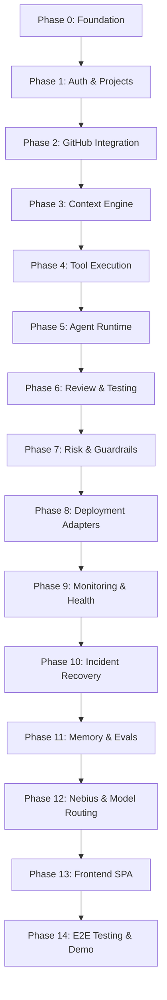

# Development Workflow & Phased Implementation Roadmap

**Document Version:** 1.0.0  
**Status:** Engineering Roadmap  
**Guiding Architecture:** Modular Monolith with Strict Agent/Platform Contract Separation  

---

## 1. Roadmap Overview

The AI DevOps Assistant is developed incrementally across 15 structured phases (Phase 0 through Phase 14). Each phase builds upon the immutable contracts established in Phase 0 without violating domain boundaries or introducing unnecessary infrastructure complexity.

---

## 2. Phase Breakdown

### Phase 0 — Foundation & Architecture Setup (Current)
- **Goal:** Establish modular monolith directory layout, environment configuration, Docker orchestration, and canonical contracts.
- **Deliverables:**
  - Standardized repository structure (`frontend/`, `backend/`, `agent/`, `contracts/`, `docs/`, `scripts/`, `docker/`).
  - Strict contract specifications (`agent_contract.md`, `tool_contract.md`, `event_contract.md`, `deployment_contract.md`, `memory_contract.md`, `review_contract.md`).
  - Architecture blueprint (`docs/architecture.md`) and development roadmap (`docs/development-workflow.md`).
  - Basic Docker Compose setup and FastAPI health check placeholder.
- **Exit Criteria:** Clean repo structure, zero contract contradictions, passing health check, and clear Phase 1 decisions documented.

---

### Phase 1 — Authentication + Projects
- **Goal:** Provide foundational user authentication and multi-project organizational scoping.
- **Deliverables:**
  - Relational schema for `User`, `Project`, `APIKey`, and `Membership`.
  - JWT-based authentication and role-based access control (RBAC).
  - FastAPI endpoints for project registration, member management, and credential setup.
- **Exit Criteria:** Users can authenticate, create a project, and retrieve project tokens.

---

### Phase 2 — GitHub Integration
- **Goal:** Connect platform to GitHub repositories and ingest code lifecycle events.
- **Deliverables:**
  - GitHub App / Personal Access Token integration service.
  - Webhook ingestion endpoint verifying HMAC signatures.
  - Emission of `PR_OPENED`, `PR_UPDATED` events into the internal Event Bus.
  - Platform service to fetch PR metadata, commits, and unified diffs.
- **Exit Criteria:** Ingested GitHub webhooks reliably emit canonical events and persist PR records.

---

### Phase 3 — Context Engine
- **Goal:** Assemble deterministic, token-efficient contextual representations for code changes.
- **Deliverables:**
  - Diff parser and AST / file-tree summarizer.
  - Context packing service that bundles PR diff, project metadata, commit history, and test requirements.
  - Strict truncation strategies avoiding LLM token limit overflows.
- **Exit Criteria:** Given a PR number, the platform builds a validated `AgentContext` object conforming to `contracts/agent_contract.md`.

---

### Phase 4 — Tool Execution
- **Goal:** Implement the secure Platform Tool Registry and gatekeeper pipeline.
- **Deliverables:**
  - Tool Registry supporting tool discovery and JSON Schema validation.
  - Permission guard verifying required permissions against `AgentContext`.
  - Concrete platform execution wrappers for:
    - `github.get_repository`
    - `github.get_pull_request`
    - `github.get_diff`
    - `tests.run`
  - Structured error wrapping and audit log persistence.
- **Exit Criteria:** Isolated unit and integration tests verifying tool schemas, permission denials, and execution envelopes.

---

### Phase 5 — Agent Runtime
- **Goal:** Implement the core agent loop using strict tool contract invocations.
- **Deliverables:**
  - Execution harness implementing `agent.run(goal, context, tools, permissions)`.
  - ReAct (Reasoning + Acting) loop managing observation, thought, and tool call generation.
  - Step counter, budget enforcement, and timeout guardrails.
  - State preservation and `AgentResult` generation.
- **Exit Criteria:** Agent runtime completes multi-step synthetic tasks solely by invoking registered tools.

---

### Phase 6 — Review + Testing
- **Goal:** Automate intelligent code reviews and pre-deployment test validation.
- **Deliverables:**
  - Review engine emitting validated `ReviewResult` objects matching `contracts/review_contract.md`.
  - Test runner executor isolating unit test runs.
  - Automated publishing of inline PR comments and summary reviews on GitHub.
  - Emission of `REVIEW_STARTED`, `REVIEW_COMPLETED`, `TEST_STARTED`, `TEST_COMPLETED` events.
- **Exit Criteria:** Pull requests receive automated structured reviews with findings and severity scores.

---

### Phase 7 — Risk + Guardrails
- **Goal:** Implement deterministic safety gates to prevent high-risk deployments.
- **Deliverables:**
  - Risk scoring engine evaluating diff size, critical file modifications (migrations, security configs), test results, and review severity.
  - Human-in-the-loop approval workflows for `HIGH` or `CRITICAL` risk classifications.
  - Audit trails for gate bypasses or approvals.
- **Exit Criteria:** High-risk PRs require explicit approval before advancing to the deployment stage.

---

### Phase 8 — Deployment
- **Goal:** Implement the uniform deployment provider abstraction and concrete adapters.
- **Deliverables:**
  - `DeploymentService` managing the 10 canonical deployment states.
  - `VercelAdapter` (frontend/edge deployment and alias management).
  - `RenderAdapter` (backend service/worker deployment and status polling).
  - Platform deployment tools: `deployment.deploy`, `deployment.status`, `deployment.logs`, `deployment.rollback`.
  - Emission of `DEPLOYMENT_STARTED`, `DEPLOYMENT_COMPLETED`, `DEPLOYMENT_FAILED`.
- **Exit Criteria:** Applications successfully deploy to Vercel and Render through the unified interface.

---

### Phase 9 — Monitoring
- **Goal:** Implement continuous post-deployment health verification and log aggregation.
- **Deliverables:**
  - Synthetic health check runner polling deployed endpoints.
  - Error rate and latency anomaly detector.
  - Log fetcher streaming runtime logs from provider adapters.
  - Emission of `HEALTH_CHECK_FAILED` when probes fail.
- **Exit Criteria:** Faulty deployments are flagged within 60 seconds of rollout.

---

### Phase 10 — Incident Recovery
- **Goal:** Enable autonomous incident triage, root cause diagnosis, and safe rollback.
- **Deliverables:**
  - Incident management service emitting `INCIDENT_CREATED`.
  - Autonomous diagnosis agent invoking `deployment.logs` and `github.get_diff` to identify root causes.
  - Automated or one-click rollback orchestration (`ROLLBACK_STARTED`, `ROLLBACK_COMPLETED`, `RECOVERY_COMPLETED`).
- **Exit Criteria:** Broken deployment automatically triggers diagnosis, executes rollback, and restores system health.

---

### Phase 11 — Memory + Evals
- **Goal:** Add cross-session project memory and quantitative evaluation harnesses.
- **Deliverables:**
  - Integration of `pgvector` for semantic similarity retrieval over past incidents and architectural rules.
  - Memory read/write tools implementing `contracts/memory_contract.md`.
  - Continuous evaluation harness measuring review accuracy, false-positive rates, and recovery latency.
- **Exit Criteria:** Agent successfully recalls past incident resolutions to speed up root-cause diagnosis.

---

### Phase 12 — Nebius + Model Routing
- **Goal:** Integrate GPU model serving on Nebius AI Cloud and dynamic hybrid LLM routing.
- **Deliverables:**
  - `NebiusAdapter` for deploying and managing GPU model workloads.
  - Model router:
    - **DeepSeek:** Dispatched for fast, routine diff parsing, syntax linting, and basic queries.
    - **NVIDIA Nemotron on Nebius:** Dispatched for deep reasoning, architectural risk scoring, and post-mortem diagnosis.
- **Exit Criteria:** Complex risk assessments automatically leverage Nemotron via Nebius inference endpoints.

---

### Phase 13 — Frontend
- **Goal:** Deliver an intuitive, responsive React + TypeScript single-page application.
- **Deliverables:**
  - Interactive pipeline visualizer showing PR -> Review -> Test -> Deploy -> Monitor flow.
  - Real-time event stream via Server-Sent Events (SSE).
  - Incident diagnosis drawer with log viewer and one-click rollback trigger.
  - Risk assessment breakdown and review findings explorer.
- **Exit Criteria:** Operators can monitor live deployments, inspect reviews, and execute rollbacks from the browser.

---

### Phase 14 — E2E Testing + Demo
- **Goal:** End-to-end scenario validation and live hackathon demonstration readiness.
- **Deliverables:**
  - Golden-path end-to-end test suite simulating PR submission, review, deployment, simulated failure, automated diagnosis, and rollback.
  - Seed datasets, demo repository, and staging environment setups.
  - Final documentation and quickstart presentation guide.
- **Exit Criteria:** Full autonomous DevOps loop executes cleanly in a live recorded demonstration.
